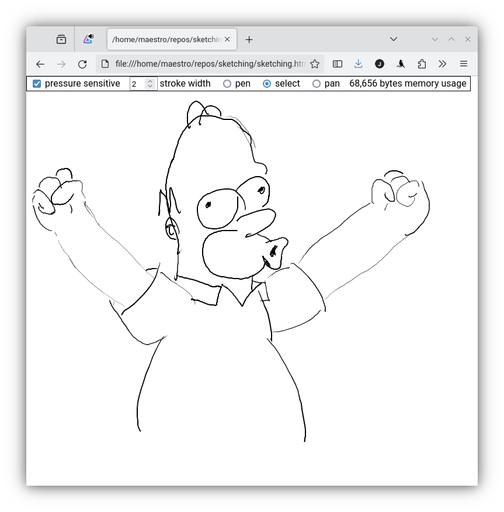

Prototype of a web-based sketching app intended to support:
  * pressure sensitivity
  * multi-touch (multiple people drawing together on a large touchscreen)

Pressure sensitivity is working (although implemented a bit hackish). Multi-touch is currently not working. Have yet to figure out the right APIs, and whether it **is** actually possible to implement in a browser.